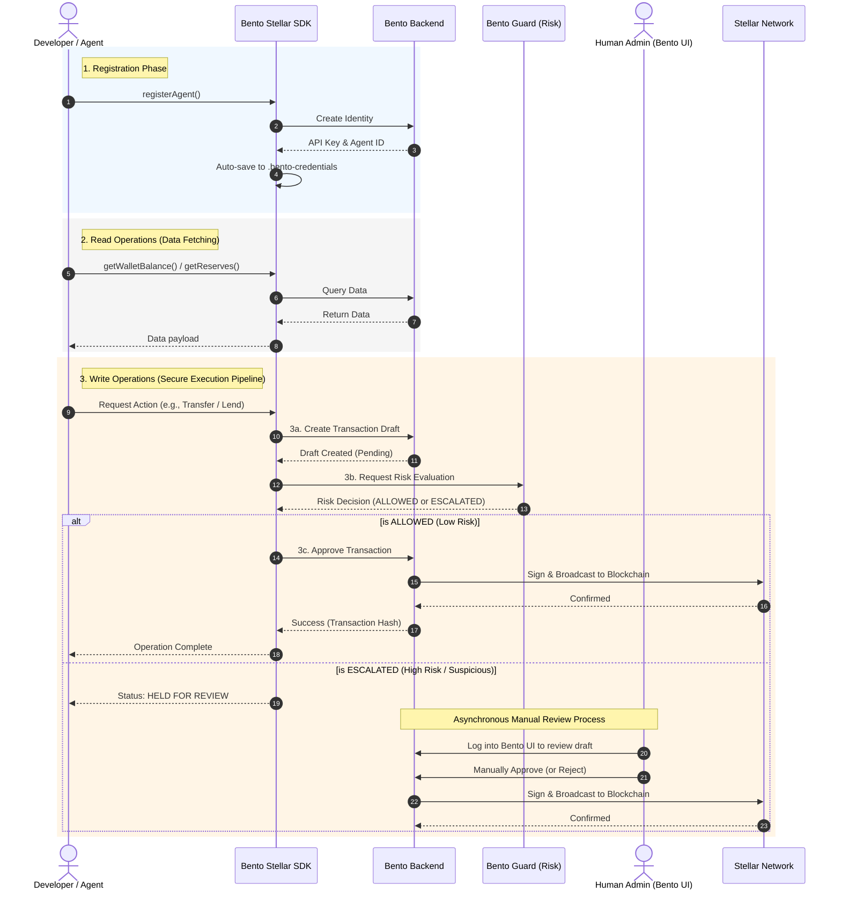

# Bento Stellar SDK

[](./package.json)
[](#license)
[](https://www.npmjs.com/package/@bentoguard/protocol-sdk)

A production-ready TypeScript SDK for AI agents to authenticate, manage wallets, and execute lending transactions on the Bento Stellar backend — with built-in Bento Guard risk engine integration.

## Table of Contents

- [Introduction](#introduction)
- [Features](#features)
- [Installation](#installation)
- [Requirements](#requirements)
- [Quick Start](#quick-start)
- [Project Structure](#project-structure)
- [Core Concepts](#core-concepts)
- [Security Gate (Bento Guard)](#security-gate-bento-guard)
- [Configuration](#configuration)
- [Usage](#usage)
- [Error Handling](#error-handling)
- [Best Practices](#best-practices)
- [API Overview](#api-overview)
- [FAQ](#faq)
- [Troubleshooting](#troubleshooting)
- [Contributing](#contributing)
- [License](#license)

## Introduction

Bento Stellar SDK is the agent-facing client for the Bento Stellar backend. It gives AI agents a typed, ergonomic way to interact with the backend without hardcoding routes or managing request concerns in every integration.

All agent write operations (transfer, lending actions) automatically pass through a **3-step secure execution pipeline**:
1. Create a transaction draft
2. Run the Bento Guard Risk Engine
3. Approve and broadcast (if ALLOWED), or hold for review (if ESCALATED)



Credentials (`agentId` and `apiKey`) are persisted to a `.bento-credentials` file automatically on first registration. Subsequent runs load them transparently — no manual configuration needed.

## Features

- Agent registration and claim status workflows
- Automatic credential persistence via `.bento-credentials`
- Embedded wallet balance query and asset transfer
- Transaction create and approve flows
- Lending pool market discovery (info, reserves, position)
- Lending actions: deposit, borrow, repay, withdraw, submit (batch)
- **Bento Guard integration**: all agent write operations are gated by the risk engine automatically
- Typed request/response contracts via TypeScript
- Centralized versioned endpoint builder (`buildEndpoint`)
- Normalized error types with HTTP status code and response payload
- Clean module-based API surface

## Installation

```bash
npm install @bentoguard/protocol-sdk
```

## Requirements

- Node.js >= 18
- TypeScript >= 5
- Network access to the Bento backend

## Quick Start

```ts
import { BlendServiceClient, auth, embeddedWallet, lendingPool } from '@bentoguard/protocol-sdk';

// Client auto-loads credentials from .bento-credentials if present
const client = new BlendServiceClient();
const agentAuth = auth.createAgentIdentityApi(client);

// First run: register the agent (saves .bento-credentials automatically)
const result = await agentAuth.registerAgent({
  name: 'My Agent',
  handle: 'my_agent',
  quote: 'Here to lend.',
});
console.log('Agent ID:', result.agentId);
console.log('Claim Token:', (await agentAuth.getClaimStatus()).claimToken);

// Subsequent runs: credentials already in .bento-credentials, just use the modules
const balance = await embeddedWallet.getWalletBalance(client);
const reserves = await lendingPool.getReserves(client);
console.log({ balance, reserves });
```

## Project Structure

```text
src/
  constants/         # Endpoint builder, version/module enums (Version, Module)
  core/              # HTTP client (BentoStellarClient / BlendServiceClient) and credential store
  errors/            # SDK error types: BentoError, BentoAPIError, BentoAuthError
  modules/
    auth/            # Agent registration and claim status
    embedded_wallet/ # Wallet balance, transfer, create/approve transaction
    lending_pool/    # Market info, reserves, position, deposit/borrow/repay/withdraw/submit
  types/             # Shared TypeScript request/response interfaces
  utils/
    request.ts       # postJson, getJson — typed HTTP helpers
    security.ts      # executeSecureAgentAction — 3-step Bento Guard pipeline
```

## Core Concepts

- **`BlendServiceClient`** — shared HTTP client that injects `x-bento-api-key` from `.bento-credentials` and centralizes request/error behavior.
- **`FileTokenStore`** — default credential store backed by `.bento-credentials` in the working directory (mode `0600`).
- **Agent** — an autonomous identity registered on the backend with its own wallet and lending position.
- **Claim** — the process by which a human owner links their account to the agent. Required before certain protected operations.
- **Pool** — the Blend Protocol lending market for discovery and transaction actions.
- **Secure Action** — agent write operations go through `executeSecureAgentAction`, which creates a draft, checks the risk engine, then broadcasts on ALLOW.

## Security Gate (Bento Guard)

All agent write operations (lending actions and transfers) automatically go through a 3-step pipeline when an `instruction` is provided:

```text
Step 1 → Create transaction draft            → { transaction_id }
Step 2 → Risk Engine evaluates instruction   → verdict: ALLOW | ESCALATED | BLOCKED
Step 3 → ALLOW:     approve & broadcast tx
         ESCALATED: return { status, transaction_id, reason }
         BLOCKED:   throw Error
```

Populate the `instruction` and `resolvedTargets` fields in your request to activate the security gate:

```ts
await lendingPool.deposit(client, {
  assetPubkey: 'CDLZFC3SYJYDZT7K67VZ75HPJVIEUVNIXF47ZG2FB2RMQQVU2HHGCYSC',
  amount: '100',
  instruction: 'Deposit 100 XLM into the lending pool',
  resolvedTargets: {
    assetPubkeys: ['CDLZFC3SYJYDZT7K67VZ75HPJVIEUVNIXF47ZG2FB2RMQQVU2HHGCYSC'],
  },
});
```

If `instruction` is omitted, the SDK returns the draft ID directly for manual approval.

## Configuration

`BlendServiceClient` accepts optional parameters:

```ts
new BlendServiceClient({
  timeoutMs: 30_000,                           // default: 30000ms
});
```

| Option | Description |
|--------|-------------|
| `baseURL` | Backend base URL. Falls back to `BENTO_BASE_URL` env, then `http://localhost:4001`. |
| `timeoutMs` | Per-request timeout in milliseconds. |
| `tokenStore` | Custom `TokenStore` implementation. |

Environment variable fallback for API key (if `.bento-credentials` is absent):

```
BENTO_AGENT_API_KEY=<your api key>
```

## Usage

### Initialize Client

```ts
import { BlendServiceClient } from '@bentoguard/protocol-sdk';

const client = new BlendServiceClient();
```

### Register Agent (first run only)

```ts
import { auth } from '@bentoguard/protocol-sdk';

const agentAuth = auth.createAgentIdentityApi(client);

const result = await agentAuth.registerAgent({
  name: 'My Agent',
  handle: 'my_agent',
  quote: 'Autonomous lending agent',
});
// .bento-credentials written automatically — agentId + apiKey
```

### Check Claim Status

```ts
const status = await agentAuth.getClaimStatus();
// status.claimToken — share this with the owner to link their account
```

### Regenerate Claim Link

```ts
await agentAuth.regenerateClaimToken();
```

### Wallet Balance

```ts
import { embeddedWallet } from '@bentoguard/protocol-sdk';

const balance = await embeddedWallet.getWalletBalance(client);
console.log(balance); // { balances: [{ asset, amount }], ... }
```

### Transfer Asset

```ts
await embeddedWallet.transferAsset(client, {
  targetPubkey: 'GABC...',
  assetPubkey: 'CDLZ...',   // use asset contract pubkey, or 'XLM' for native
  amount: '25',
  instruction: 'Transfer 25 XLM to GABC...',   // required to trigger Bento Guard
  resolvedTargets: {
    receiverPubkey: 'GABC...',
    assetPubkeys: ['CDLZ...'],
  },
});
```

### Create & Approve Transaction (manual flow)

```ts
// Step 1: create draft
const draft = await embeddedWallet.createTransaction(client, {
  params: { to: 'GABC...', amount: '10', token: 'XLM' },
});

// Step 2: approve and broadcast
await embeddedWallet.approveTransaction(client, { txId: draft.transaction_id });
```

### Read Market State

```ts
import { lendingPool } from '@bentoguard/protocol-sdk';

const info = await lendingPool.getInfo(client);
const reserves = await lendingPool.getReserves(client);
const position = await lendingPool.getPosition(client);
```

### Lending Actions

```ts
await lendingPool.deposit(client, {
  assetPubkey: 'CDLZ...',
  amount: '100',
  instruction: 'Deposit 100 XLM into the lending pool',
  resolvedTargets: { assetPubkeys: ['CDLZ...'] },
});

await lendingPool.borrow(client, { assetPubkey: 'CDLZ...', amount: '50' });
await lendingPool.repay(client, { assetPubkey: 'CDLZ...', amount: '50' });   // or 'max'
await lendingPool.withdraw(client, { assetPubkey: 'CDLZ...', amount: '10' }); // or 'max'
```

> **Note:** `assetPubkey` replaces the old `assetId` field. All lending request types now use `assetPubkey`.

### Batch (Submit)

```ts
await lendingPool.submit(client, {
  requests: [
    { actionType: 'REPAY', assetPubkey: 'CDLZ...', amount: '25' },
    { actionType: 'WITHDRAW', assetPubkey: 'CDLZ...', amount: '10' },
  ],
  instruction: 'Repay 25 and withdraw 10',
});
```

Valid `actionType` values: `DEPOSIT`, `BORROW`, `REPAY`, `WITHDRAW`.

### Clear Credentials

```ts
client.clearCredentials();
```

## Error Handling

```ts
import { utils } from '@bentoguard/protocol-sdk';

try {
  await lendingPool.deposit(client, { assetPubkey: 'CDLZ...', amount: '100' });
} catch (error) {
  if (error instanceof utils.BentoAuthError) {
    // 401 — apiKey missing or invalid, check .bento-credentials
  } else if (error instanceof utils.BentoAPIError) {
    console.error('HTTP status:', error.statusCode);
    console.error('Response:', error.response);
  } else if (error instanceof utils.BentoError) {
    console.error('SDK error:', error.message);
  }
}
```

| Error class | When it fires |
|-------------|---------------|
| `BentoAuthError` | `401` — API key missing or invalid |
| `BentoAPIError` | `4xx / 5xx` — check `statusCode` and `response` |
| `BentoConfigError` | Missing required config at startup |
| `BentoError` | Generic SDK-level failure |

**Risk Engine Verdicts:**

| Verdict | SDK behaviour |
|---------|---------------|
| `ALLOW` | Transaction is approved and broadcasted automatically |
| `ESCALATED` | Returns `{ status: 'escalated', transaction_id, reason }` — awaits manual review |
| `BLOCKED` | Throws `Error: Security Gate Blocked Action: <reason>` |

## Best Practices

- Rely on `.bento-credentials` written by `registerAgent()` — do not hardcode API keys.
- Reuse a single `BlendServiceClient` instance per process.
- Always read `getWalletBalance` and `getReserves` before executing a lending action.
- Pass `'max'` for `amount` on `repay` and `withdraw` to close positions cleanly.
- Provide `instruction` and `resolvedTargets` on all write operations so the Bento Guard risk engine has full context to make correct decisions.
- Use `submit` for atomic multi-step operations.
- Keep retry logic in your application layer — catch `BentoAPIError`, inspect `statusCode`, decide there.
- Call `client.clearCredentials()` when a session ends or becomes invalid.

## API Overview

| Action | SDK Call | Auth Required |
|--------|----------|:---:|
| Register agent | `agentAuth.registerAgent({ name, handle, quote })` | ✗ |
| Claim status | `agentAuth.getClaimStatus()` | ✓ |
| Regenerate claim | `agentAuth.regenerateClaimToken()` | ✓ |
| Wallet balance | `embeddedWallet.getWalletBalance(client)` | ✓ |
| Transfer asset | `embeddedWallet.transferAsset(client, { targetPubkey, assetPubkey, amount, instruction?, resolvedTargets? })` | ✓ |
| Create transaction | `embeddedWallet.createTransaction(client, { params })` | ✓ |
| Approve transaction | `embeddedWallet.approveTransaction(client, { txId })` | ✓ |
| Pool info | `lendingPool.getInfo(client)` | ✗ |
| Pool reserves | `lendingPool.getReserves(client)` | ✗ |
| Agent position | `lendingPool.getPosition(client)` | ✓ |
| Deposit | `lendingPool.deposit(client, { assetPubkey, amount, instruction?, resolvedTargets? })` | ✓ |
| Borrow | `lendingPool.borrow(client, { assetPubkey, amount, instruction?, resolvedTargets? })` | ✓ |
| Repay | `lendingPool.repay(client, { assetPubkey, amount, instruction?, resolvedTargets? })` | ✓ |
| Withdraw | `lendingPool.withdraw(client, { assetPubkey, amount, instruction?, resolvedTargets? })` | ✓ |
| Submit (batch) | `lendingPool.submit(client, { requests, instruction?, resolvedTargets? })` | ✓ |

> **Auth Required** = needs `x-bento-api-key` from `.bento-credentials`

## FAQ

**1. Is this SDK production ready?**
Structured for production use — readiness depends on your backend deployment.

**2. Which network does it target?**
Stellar, via versioned Bento backend routes.

**3. Does it support browsers?**
Currently targeting Node.js runtimes only.

**4. How does authentication work?**
After `registerAgent()`, the SDK saves `agentId` and `apiKey` to `.bento-credentials`. Every subsequent request automatically injects `x-bento-api-key` from that file.

**5. Do I need to set environment variables?**
No — `.bento-credentials` is the primary source. `BENTO_AGENT_API_KEY` is only a fallback if the file is absent.

**6. Can I replace the credential store?**
Yes — pass a custom `tokenStore` implementing the `TokenStore` interface to `BlendServiceClient`.

**7. Does the SDK retry automatically?**
No. Handle retries at your application or orchestration layer.

**8. What if I need to change the backend URL?**
Set `BENTO_BASE_URL` env or pass `baseURL` to `BlendServiceClient`.

**9. What changed from v0.1.x?**
- `assetId` → renamed to `assetPubkey` in all `PoolActionRequest` and `SubmitActionRequest` types
- `toAddress` / `tokenId` → renamed to `targetPubkey` / `assetPubkey` in `TransferAssetRequest`
- All agent write operations now go through the 3-step Bento Guard security pipeline (`executeSecureAgentAction`)
- Job polling (`postJobAndWait`) removed — all endpoints are now synchronous

**10. Where should I start reading the source?**
`src/core/bento-client.ts`, then `src/utils/security.ts` for the secure action pipeline, then the module folders.

## Troubleshooting

**`401 Authentication failed`** — Check `.bento-credentials` exists and `apiKey` is valid. Re-run `registerAgent()` if corrupted.

**`403 Forbidden`** — Agent claim may be required. Call `agentAuth.getClaimStatus()` and share `claimToken` with the owner.

**`Insufficient balance`** — Call `embeddedWallet.getWalletBalance(client)` before retrying. Never execute without confirming balance.

**`RPC timeout`** — Increase `timeoutMs` or check backend connectivity.

**`Module not found`** — Verify import path matches the exported module namespace from `@bentoguard/protocol-sdk`.

**`Endpoint mismatch`** — Use `buildEndpoint(Version, Module, path)` rather than hardcoding strings.

**`Security Gate Blocked Action`** — The risk engine rejected the transaction. Check the `reason` in the error message. Ensure `resolvedTargets` accurately reflects the transaction's actual targets.

**`status: 'escalated'`** — The transaction is pending manual review in the Bento dashboard. The `transaction_id` is returned so you can track it.

## Contributing

1. Branch from the repository.
2. Make small, focused changes.
3. Run tests: `npm run test`
4. Run build: `npm run build`
5. Open a pull request with a clear description of what SDK surface changed.

## License

MIT
